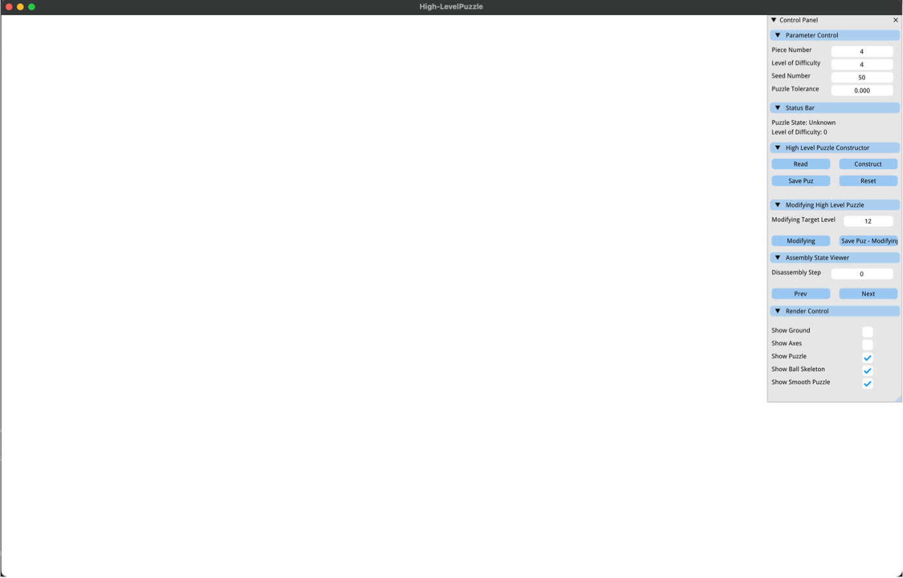
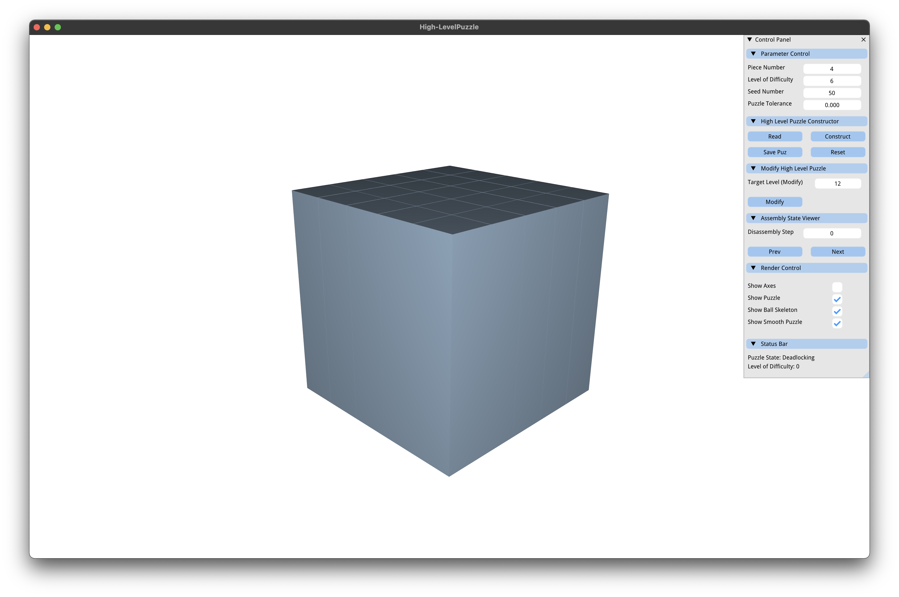
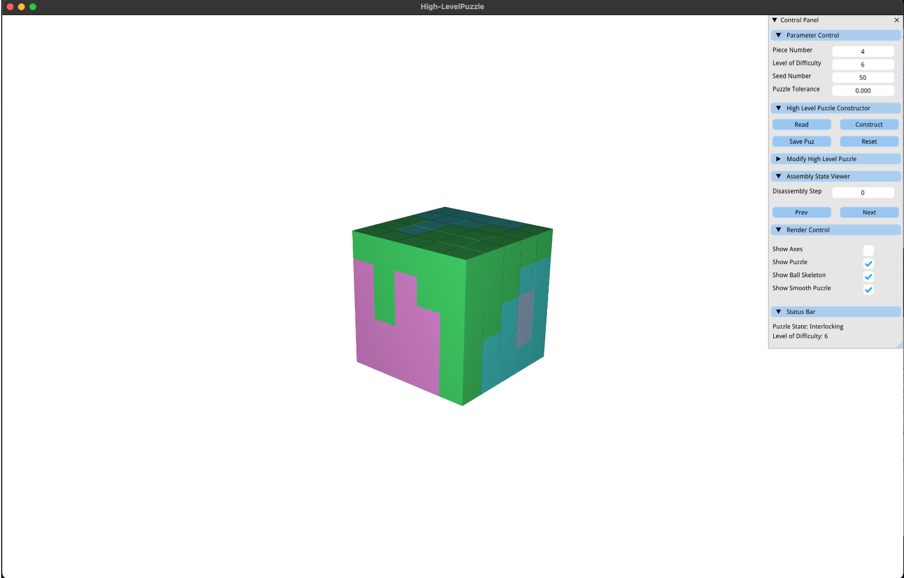
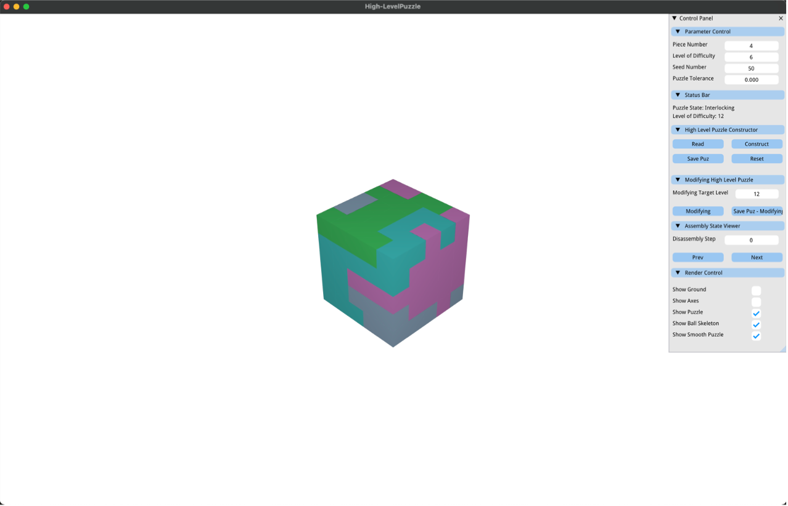
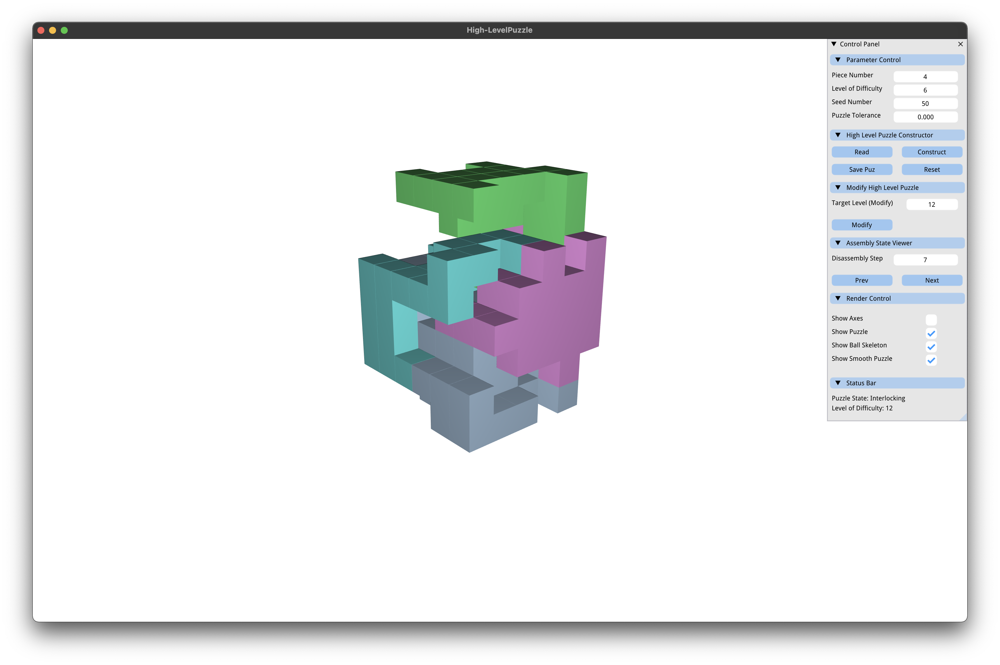

<p align="center">
  <a href="" rel="noopener">
 </a>
</p>

<h3 align="center">Computational Design of High-level Interlocking Puzzles</h3>

<div align="center">

  []() 
  [](/LICENSE)

</div>

This repo is an implementation of [Computational Design of High-level Interlocking Puzzles](doc/High-LevelPuzzle.pdf) [Chen et al. 2022]. Commercial licensing is available upon request. If you have any problems when using this code, you can contact me any time through rulin_chen@mymail.sutd.edu.sg. 

If you make use of this repo in your scientific work, please cite our paper. For your convenience,
you can use the following bibtex snippet:

    @article{Chen-2022-High-levelPuzzle,
     author = {Rulin, Chen and Ziqi, Wang and Peng, Song and Bernd, Bickel},
     title = {Computational Design of High-level Interlocking Puzzles},
     journal = {ACM Transactions on Graphics (SIGGRAPH 2022)},
     year = {2022},
     publisher = {ACM},
     keywords = {interlocking puzzle, level of difficulty, disassembly planning, computational design},
    }

## Table of Contents
- [About](#about)
- [Getting Started](#getting_started)
- [Usage](#usage)
- [Create a High-level Interlocking Puzzle by Yourself!](#create_puzzle)
- [Authors](#authors)
- [Acknowledgments](#acknowledgement)

## About <a name = "about"></a>
This repo presents a computational approach to design high-level interlocking puzzles. We implemented our computational design tool in C++ and `libigl` [Jacobson et al. 2018] on a desktop computer with 3.6 GHz 8-Core Intel processor and 16 GB RAM. 

## Getting Started <a name = "getting_started"></a>
These instructions will get you a copy of the project up and running on your local machine for development and testing purposes.

### Prerequisites
We need to install `CGAL` before running our code. With the help of `brew`, we can easily get `GGAL`.

```
brew install cgal
```

### Compile

```
cd [current folder path]
mkdir build
cd build
cmake ..
make
```


## Usage <a name = "usage"></a>
These instructions guide you how to use our code to generate high-level interlocking puzzle by yourself.

Here is the control panel of our high-level puzzle generator. There are 6 components in the control panel: `Parameter Control`, `Status Bar`, `High Level Puzzle Constructor`, `Modifying High Level Puzzle`, `Assembly State Viewer` and `Render Control`.

<p align="center">
  <a href="" rel="noopener">
 </a>
</p>

### Parameter Control

`Piece Number`  Determine the number of pieces *K*.

`Level of Difficulty` Determine the level of difficulty *L*. The program will keep running until constructing a puzzle with level of difficulty equal or higher than *L*.

`Seed Number` With the same seed number, users can regenerate the same puzzle as before.

`Puzzle Tolerance` This parameter is set for fabrication only, which can control the gap between pieces.

### Status Bar

`Puzzle State` Indicate state (e.g. interlocking and deadlocking) of current puzzle.

`Level of Difficulty` Level of difficult of current puzzle.

### High Level Puzzle Constructor

`Read` Our program can read 2 types of input files: *.puz* and *.vol* file. 

`Construct` Construct the *K* piece level-*L* puzzle with given import volume.

`Save Puz` Save puzzle generated by our program.

`Reset` Reset all the parameters.

### Modifying High Level Puzzle
From our observation, *High Level Puzzle Constructor* can easily find a puzzle if the target level is less than 10. If you want to generate a higher level puzzle, you can modify current puzzle to reach higher level puzzle.

`Modifying Target Level` The target level after modifying current puzzle.

`Modifying` Start modifying currrent puzzle. 

### Assembly State Viewer

`Disassembly Step` Determine the disassembly step.

`Prev` Previous disassembly step.

`Next` Next disassembly step.

### Render Control
Control the object visualization state.

## Create a High-level Interlocking Puzzle by Yourself! <a name = "create_puzzle"></a>

### Step 1: import a volume
Import a Cube_5x5x5_E1.vol volume file by clicking `read` button.

<p align="center">
  <a href="" rel="noopener">
 </a>
</p>

### Step 2: create a level-6 cube puzzle
Set the `Level of Difficulty` as 6 and click the `Construct` button to create a piece-4 level-7 cube puzzle.

<p align="center">
  <a href="" rel="noopener">
 </a>
</p>

### Step 3: modifying to reach a level-12 puzzle
Set the `Modifying Target Level` as 12 and click the `Modifying` button to start modifying.

<p align="center">
  <a href="" rel="noopener">
 </a>
</p>

### Step 4: visualize disassembly steps
Click the `Next` to visualize how to disassemble the current puzzle. 

<p align="center">
  <a href="" rel="noopener">
 </a>
</p>

### Step 5: save puzzle for fabrication
Set the `Puzzle Tolerance` greater than 0 to create gaps between pieces. Here we suggest to set 0.005. Lastly, you can click `Save Puz` to save the .puz file and .obj files of each piece that can be used for fabrication.

## Authors <a name = "authors"></a>
- [Rulin Chen](https://github.com/Linsanity81) 
- [Ziqi Wang](https://kiki007.github.io/)
- [Peng Song](https://songpenghit.github.io/)
- [Bernd Bickel](http://berndbickel.com/)

## Acknowledgements <a name = "acknowledgement"></a>
TODO...


