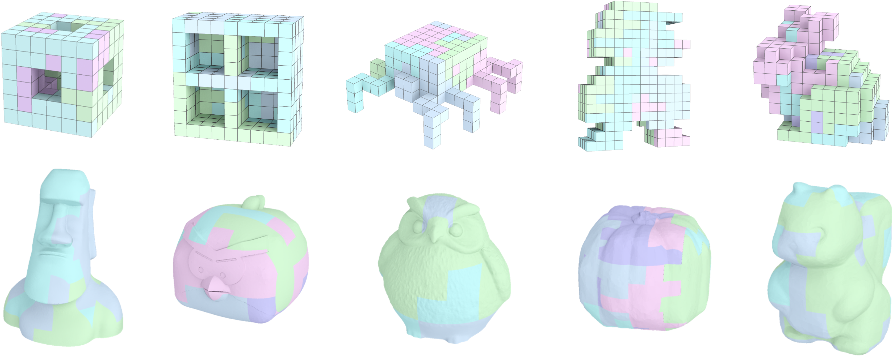

<p align="center">
  <a href="" rel="noopener">
 </a>
</p>

<h3 align="center">Computational Design of High-level Interlocking Puzzles</h3>

<div align="center">

  []() 
  [](/LICENSE)

</div>

This repo is an implementation of [Computational Design of High-level Interlocking Puzzles](doc/High-LevelPuzzle.pdf) [Chen et al. 2022]. Commercial licensing is available upon request.

If you make use of this repo in your scientific work, please cite our paper. For your convenience,
you can use the following bibtex snippet:

    @article{
     author = {Rulin, Chen and Ziqi, Wang and Peng, Song and Bernd, Bickel},
     title = {Computational Design of High-level Interlocking Puzzles},
     journal = {ACM Trans. Graph.},
     year = {2022},
     publisher = {ACM},
     keywords = {interlocking puzzle, level of difficulty, disassembly planning, computational design},
    }

## Table of Contents
- [About](#about)
- [Getting Started](#getting_started)
- [Deployment](#deployment)
- [Usage](#usage)
- [Built Using](#built_using)
- [TODO](../TODO.md)
- [Contributing](../CONTRIBUTING.md)
- [Authors](#authors)
- [Acknowledgments](#acknowledgement)

## About <a name = "about"></a>
This repo presents a computational approach to design high-level interlocking puzzles. We implemented our computational design tool in C++ and `libigl` [Jacobson et al. 2018] on a desktop computer with 3.6 GHz 8-Core Intel processor and 16 GB RAM.

## Getting Started <a name = "getting_started"></a>
These instructions will get you a copy of the project up and running on your local machine for development and testing purposes. See [deployment](#deployment) for notes on how to deploy the project on a live system.

### Prerequisites
We need to install `CGAL` before running our code. With the help of `brew`, we can easily get `GGAL`.

```
brew install cgal
```